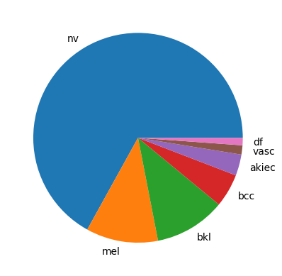
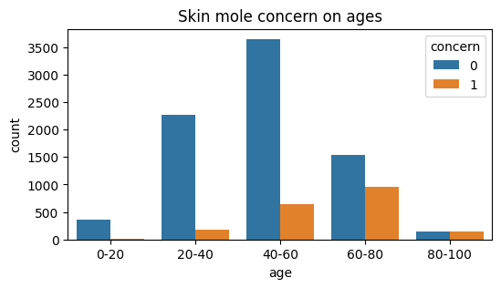
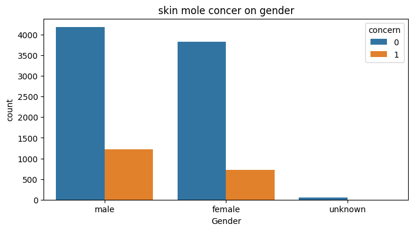

# Skin mole type classification

This project aims to create a model that classifies skin mole type by training skin MNIST dataset(HAM10000) of dermatological imags.
The data set contains 10015 images and a metadata as a csv file which contains the image ID coresponds to image name, the corresponding label, the patient age and area of body part from which the image taken.
There are 7 types of skin mole type or labels given in the dataset as shown bellow of which, nv, bkl, df and vasc are of no concerning but the others are concerning because they are reported as type of cancerous images. Based on this inforamtion the model prediction result is canerous or non cancerous.

      1. 'nv': 'Melanocytic nevi'
      2. 'mel': 'Melanoma'
      3. 'bkl': 'Benign keratosis-like lesions '
      4. 'bcc': 'Basal cell carcinoma'
      5. 'akiec': 'Actinic keratoses'
      6. 'vasc': 'Vascular lesions'
      7. 'df': 'Dermatofibroma'

Of the total of 10015 datasets the following pi chart shows how much portion of each mole type recored.

      

             
      

The following plots show the distribution of conserning moles across age groupd and gender.

    

           
             
      

I have created and train different models using differnt frameworks, including transfer larning with pretrained models (just for learning ) and finally i have selected CNN with keras framework as it is simple to implement, and deploy. The model is deployed using streamlit and can be used by runnig the following code

    > python3 Deployment/streamlit.py 

        OR

    > python Deployment/streamlit.py 

Running the above code directs to the web app locally hosted and user can upload images and use prediction button to check if the given image is cancerous or not. The user interface also gives information of the statistics on the distribution of skin cancers based on age group and gender.

The accuracy and loss of the model are shown bellow

      

           
             
      

    

       
         
    

    
        

## Prerequisites
 
The following python libraries are used in this program
  1. Pandas
  2. Matplotlib
  3. Seaborn
  4. tensorflow
  5. keras
  5. Sklearn
  7. Open CV
  8. Streamlit
 
	
## License

Free license

## Contact

Genet Abay Shiferaw: genetabay.s@gmail.com

Repository link : https://github.com/Genet-Abay/ArcelorMittal-Constriction-identification

## Acknowledgments

BeCode Arai4 AI coaches(Chrysanthi and Louis)